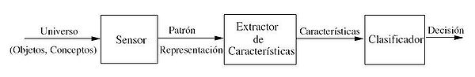
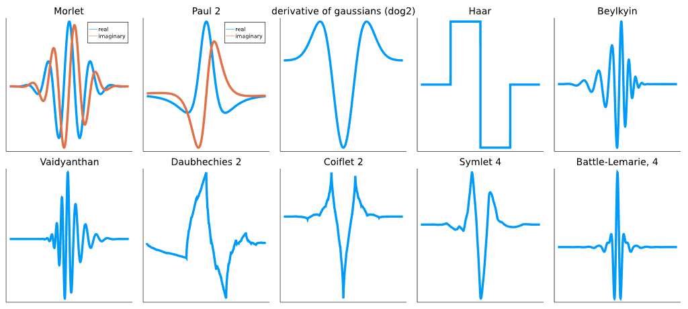

# Introducción 📖
Se propone realizar un programa que realice diferentes pruebas con los operadores de <a href="https://la.mathworks.com/help/images/ref/edge.html">edge</a> y proponer uno nuevo, pero antes de comenzar:

## ¿Qué es el procesamiento digital de imagenes (PDI)? 🤷‍♂️🤷‍
PDI se puede definir como el conjunto de procesamientos que se realizan sobre una imagen digital ya sea para realizar su almacenamiento, transmisión o tratamiento.

## Lectura de imágenes en matlab 👓
Para leer una imágen en matlab se utiliza la función <a href="https://la.mathworks.com/help/matlab/ref/imread.html"> **imread**</a> y se asigna a una variable que representara a la imágen.

<h5 align="center"><code>imagen = imread('ruta/nombre de la imágen.extensión');</code></h5>

## RECONOCIMIENTO  DE PATRONES
El reconicimiento de patrones se encarga de la descripción y clasificación de objetos, personas, señales, representaciones, etc.

Trabaja con base en un conjunto previamente establecido de todos los posibles objetos **(patrones)** individuales a reconocer.

El margen de aplicaciones del reconocimiento de patrones es muy amplio, sin embargo las más importantes están relacionadas con la visión artificial.

El esquema de un sitema de reconocimiento de patrones consta de varias etapas relacionadas entre sí.

El **sensor** tiene como propósito proporcionar una representación factible de los elementos del universo a ser clasificados.

La **extracción de caracteristicas** es la etapa que se encarga de extraer la información discriminatoria eliminando la información redundante e irrelevante.

El **clasificador** es la etapa de toma de **decisiones en el sistema**, va a asignar los objetos de clase desconocida a la categoria apropiada.

## TRANSFORMADA WAVELET
Las wavelets proveen un poderoso y muy variado grupo de herramientas para enfrentar problemas fundamentales, en este caso en procesamiento de imágenes han sido de gran utilidad en:
* Eliminación de ruido
* Compresión
* Reconocimiento de patrones
* **Esteganografía**

Las wavelets nos permiten estudiar la estructura tiempo - frecuencia de las señales.

En el caso de las imágenes, nos permite hacer un cambio del espacio a la frecuencia.

El análisis wavelet se basa, al igual que la teoría de Fourier, en el concepto de aproximación de señales usando la superposición de señales. La diferencia entre la teoría de Fourier y la teoría Wavelet redica en que las funciones wavelet varian tanto en frecuencia como en escala.

De manera muy general, la transformada wavelet de una función es la descomposición de un conjunto de funciones $\Psi_{s,\tau}(t)$ que forman una base. La transformada wavelet se define como

$$W_f(s,\tau)=\int f(t)\Psi_{s,\tau}^{*}(t)dt$$

Las wavelets son generadas a partir de la traslación y cambio de escala de una misma función wavelet $\Psi(t)$, llamada la "**wavelet madre**", y se define como:

$$\Psi_{s,\tau}(t)=\frac{1}{\sqrt{s}}\bar{\Psi}\left(\frac{t-\tau}{s}\right)$$

Donde $\frac{1}{\sqrt{s}}\bar{\Psi}\left(\frac{t-\tau}{s}\right)$ es la wavelet madre compleja conjugada.

El resultado está en función de lo que representa la escala, es decir, la adaptación de la wavelet a una sección de la señal original que es la traslación o desplazamiento de la wavelet. La transformada wavelet permite obtener información relacionada con el tiempo y la frecuencia, se representación gráfica se encuentra sobre un plano llamado tiempo - escala.

## TRANSFORMADA WAVELET DISCRETA
El ánalisis wavelet para señales discretas utiliza una familia de wavelets orto-normales, es decir, que las wavelets son ortogonales y normalizadas para tener una energia unitaria.

$$\Psi_{j,k}^{[n]}=2^{-j/2}\Psi[2^{-j}n-k]$$

donde **j** y **k** son enteros que escalan y dilatan la función madre para generar la familia de wavelets discretas. Es decir, **j** indica la anchura de la wavelet y **k** determina la posición.

Para analizar el dominio de datos de diferentes resoluciones, la wavelet madre es utilizada en la siguiente función de escalamiento:

$$\phi[n]=\sum_{k=-1}^{N-2}(-1)^{k}c_{k+1}\Psi[2n+k]$$

Donde $c_{k}$ son los coeficientes wavelet. Para entender este concepto, es más sencillo pensar en los coeficientes $c_{k}$ como un filtro. Estos coeficientes son acomodados en la matriz de transformación que se aplica a un vector de datos. De esta manera, se acomodan los coeficientes en dos patrones diferentes, uno que trabaja como un filtro pasa-bajas y otro como filtro pasa-altas. A este acomodo de los coeficientes se les conoce como filtros espejos en cuadratura.

El valor de los coeficientes va a depender de la wavelet con la que se esté trabajando, por ejemplo:
* Haar
* Daubechies
* Coiflets
* Symlets
* Shannon
* Murlet

Al pasar la señal a través de un banco de filtros espejo en cuadratura, la señal resultante de cada filtro es diezmada por un factor de 2

* Nota.- En el procesamiento digital de señales un **filtro espejo en cuadratura [Quadrature mirror filter, QMF]** es un filtro que divide la señal de entrada en dos bandas "opuestas" que posteriormente suelen ser submuestreadas.

La resolución de la señal, la cual es una medida de la cantidad detallada de la información dentro de la señal, se modifica por la acción de filtrado y la escala se modifica por la operación de diezmado.

### Resultados ⚗🧪

Se propuso usar 7 imagenes diferentes y probar los 7 metodos descritos en la documentación de matlab (los 7 metodos se aplicaron a cada imagen), a continuación se muestran los resultados obtenidos

<a href="https://github.com/ArturoEmmanuelToledoAguado/Edge/blob/main/Edge.m">Código</a>