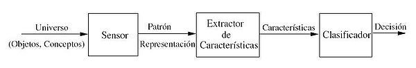
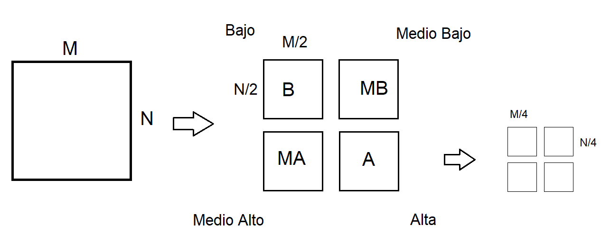
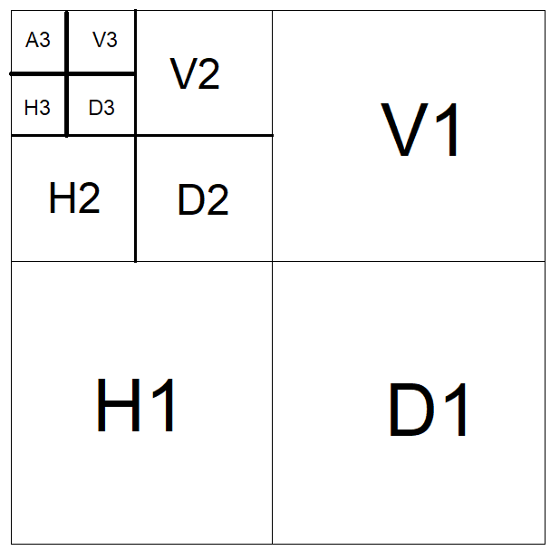
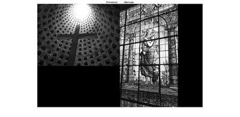
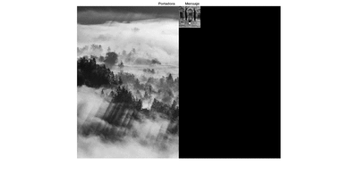

# Introducción 📖
Se propone realizar un programa que use DWT para ocultar una imagen dentro de otra (esteganografia), se recomienda leer la documentación de <a href="https://la.mathworks.com/help/wavelet/ref/wfilters.html">wfilters</a>, <a href="https://la.mathworks.com/help/wavelet/ref/dwt2.html?s_tid=doc_ta">dwt2</a> y <a href="https://la.mathworks.com/help/wavelet/ref/idwt2.html?s_tid=doc_ta">idwt2</a>; pero antes de comenzar:

## ¿Qué es el procesamiento digital de imagenes (PDI)? 🤷‍♂️🤷‍
PDI se puede definir como el conjunto de procesamientos que se realizan sobre una imagen digital ya sea para realizar su almacenamiento, transmisión o tratamiento.

## Lectura de imágenes en matlab 👓
Para leer una imágen en matlab se utiliza la función <a href="https://la.mathworks.com/help/matlab/ref/imread.html"> **imread**</a> y se asigna a una variable que representara a la imágen.

<h5 align="center"><code>imagen = imread('ruta/nombre de la imágen.extensión');</code></h5>

## RECONOCIMIENTO  DE PATRONES
El reconicimiento de patrones se encarga de la descripción y clasificación de objetos, personas, señales, representaciones, etc.

Trabaja con base en un conjunto previamente establecido de todos los posibles objetos **(patrones)** individuales a reconocer.

El margen de aplicaciones del reconocimiento de patrones es muy amplio, sin embargo las más importantes están relacionadas con la visión artificial.

El esquema de un sitema de reconocimiento de patrones consta de varias etapas relacionadas entre sí.

El **sensor** tiene como propósito proporcionar una representación factible de los elementos del universo a ser clasificados.

La **extracción de caracteristicas** es la etapa que se encarga de extraer la información discriminatoria eliminando la información redundante e irrelevante.

El **clasificador** es la etapa de toma de **decisiones en el sistema**, va a asignar los objetos de clase desconocida a la categoria apropiada.

## TRANSFORMADA WAVELET
Las wavelets proveen un poderoso y muy variado grupo de herramientas para enfrentar problemas fundamentales, en este caso en procesamiento de imágenes han sido de gran utilidad en:
* Eliminación de ruido
* Compresión
* Reconocimiento de patrones
* **Esteganografía**

Las wavelets nos permiten estudiar la estructura tiempo - frecuencia de las señales.

En el caso de las imágenes, nos permite hacer un cambio del espacio a la frecuencia.

El análisis wavelet se basa, al igual que la teoría de Fourier, en el concepto de aproximación de señales usando la superposición de señales. La diferencia entre la teoría de Fourier y la teoría Wavelet redica en que las funciones wavelet varian tanto en frecuencia como en escala.

De manera muy general, la transformada wavelet de una función es la descomposición de un conjunto de funciones $\Psi_{s,\tau}(t)$ que forman una base. La transformada wavelet se define como

$$W_f(s,\tau)=\int f(t)\Psi_{s,\tau}^{*}(t)dt$$

Las wavelets son generadas a partir de la traslación y cambio de escala de una misma función wavelet $\Psi(t)$, llamada la "**wavelet madre**", y se define como:

$$\Psi_{s,\tau}(t)=\frac{1}{\sqrt{s}}\bar{\Psi}\left(\frac{t-\tau}{s}\right)$$

Donde $\frac{1}{\sqrt{s}}\bar{\Psi}\left(\frac{t-\tau}{s}\right)$ es la wavelet madre compleja conjugada.

El resultado está en función de lo que representa la escala, es decir, la adaptación de la wavelet a una sección de la señal original que es la traslación o desplazamiento de la wavelet. La transformada wavelet permite obtener información relacionada con el tiempo y la frecuencia, se representación gráfica se encuentra sobre un plano llamado tiempo - escala.

## TRANSFORMADA WAVELET DISCRETA
El ánalisis wavelet para señales discretas utiliza una familia de wavelets orto-normales, es decir, que las wavelets son ortogonales y normalizadas para tener una energia unitaria.

$$\Psi_{j,k}^{[n]}=2^{-j/2}\Psi[2^{-j}n-k]$$

donde **j** y **k** son enteros que escalan y dilatan la función madre para generar la familia de wavelets discretas. Es decir, **j** indica la anchura de la wavelet y **k** determina la posición.

Para analizar el dominio de datos de diferentes resoluciones, la wavelet madre es utilizada en la siguiente función de escalamiento:

$$\phi[n]=\sum_{k=-1}^{N-2}(-1)^{k}c_{k+1}\Psi[2n+k]$$

Donde $c_{k}$ son los coeficientes wavelet. Para entender este concepto, es más sencillo pensar en los coeficientes $c_{k}$ como un filtro. Estos coeficientes son acomodados en la matriz de transformación que se aplica a un vector de datos. De esta manera, se acomodan los coeficientes en dos patrones diferentes, uno que trabaja como un filtro pasa-bajas y otro como filtro pasa-altas. A este acomodo de los coeficientes se les conoce como filtros espejos en cuadratura.

El valor de los coeficientes va a depender de la wavelet con la que se esté trabajando, por ejemplo:
* Haar
* Daubechies
* Coiflets
* Symlets
* Shannon
* Murlet

Al pasar la señal a través de un banco de filtros espejo en cuadratura, la señal resultante de cada filtro es diezmada por un factor de 2

* Nota.- En el procesamiento digital de señales un **filtro espejo en cuadratura [Quadrature mirror filter, QMF]** es un filtro que divide la señal de entrada en dos bandas "opuestas" que posteriormente suelen ser submuestreadas.

La resolución de la señal, la cual es una medida de la cantidad detallada de la información dentro de la señal, se modifica por la acción de filtrado y la escala se modifica por la operación de diezmado.

El diezmado de una señal corresponde a la reducción de la velocidad de muestreo, o a la eliminación de algunas de las muestras de la señal.

A este proceso del filtrado y diezmado sucesivo se le conoce como codificación en sub-bandas.

La secuencia original $x[n]$ se pasa por un filtro pasa altas $g[n]$ y uno pasa bajas $h[n]$.

La codificación en sub-bandas puede repetirse cuantas veces sea necesario para una mayor descomposición. Cada nivel filtrado y diezmado resulta en la mitad del número de muestras y por lo tanto, en la mitad de la resolución en el tiempo.

 
Considerando una imagen  discreta x como una matriz de M renglones por N columnas de números reales, donde M y N son valores pares. Entonces, la DWT se obtiene realizando el siguiente procedimiento.

$$x=\begin{bmatrix}
x_{1,1} & x_{2,1} & \ldots & x_{N,1}\\
x_{1,2} & x_{2,2} & \ldots & x_{N,2}\\
\vdots & \vdots & \ddots & \vdots  \\
x_{1,M} & x_{2,M} & & x_{N.M}
\end{bmatrix}$$

Aplicar la DWT a cada fila de **x**, lo cual producirá una nueva matriz.

Aplicar la DWT a la nueva matriz, pero esta vez a cada columna.

Quedando cuatro sub-imagenes de **M/2** filas y **N/2** columnas.

$$f \rightarrow \begin{pmatrix}
a_1 & | & h_1\\
-- &  & --\\
v_1 & | & d_1
\end{pmatrix}$$

Donde $a_1$ es calculada con el promedio de las filas seguido por el promedio de las columnas, esta sub-imagen es una compresión de la imagen original, conteniendo las frecuencias bajas.

$h_1$ es calculada con el promedio de las filas y la diferencia de las columnas, aqui se conservan los detalles horizontales de la imagen y contien las frecuencias medias-bajas.

$v_1$ es similar a $h_1$, excepto que los roles de vertical y horizontal son cambiados, esta sub-imagen contiene los detalles verticales, conservando las frecuencias medias-altas.

$d_1$ contiene los detalles diagonales, se obtiene de la diferencia tanto de filas como de columnas y conserva las frecuencias altas y también aquí se concentra la mayor cantidad de ruido.

Despues de descomponer la señal en los niveles predefinidos anteriormente, se obtiene un grupo de señales que representa la misma señal pero en diferentes bandas de frecuencias. Este análisis multiresolución crea una descomposición piramidal de la imagen en varias escalas y una descomposición de los coeficientes en varios niveles **(descomposición multiresolución)** que se logra con filtros pasa bajos y pasa altas.

### DESCOMPOSICIÓN PIRAMIDAL DE COEFICIENTES

## TRANSFORMADA WAVELET HAAR
Al igual todas las demás trasformadas wavelets, la transformada Haar descompone una señal discreta en dos sub-señales de la mitad de la longitud. La subseñal $a$ es conocida como el promedio y la otra sub-señal $d$ como la diferencia. Entonces se tiene una señal discreta de la forma $f=(f_1 ,f_2 \cdots , f_N)$, donde $N$ es un entero positivo.

La sub-señal promedio es calculada con la siguiente formula:

$$a_m=\frac{x_{2m-1}+x_{2m}}{\sqrt{2}}$$

La sub-señal diferencia se obtiene de la siguiente manera:

$$d_m=\frac{x_{2m-1}-x_{2m}}{\sqrt{2}}$$

Para $m=1,2,3,\cdots,N/2$
$$a_1=\frac{x_1+x_2}{\sqrt{2}} \hspace{1cm} d_1=\frac{x_1-x_2}{\sqrt{2}} \hspace{.5cm} , a_2\frac{x_3+x_4}{\sqrt{2}} \hspace{1cm} d_2=\frac{x_3-x_4}{\sqrt{2}}$$

* Nota.- La portadora debe ser una imagen de alta resolución
* Nota.- Siempre se deben usar las altas frecuencias
* Nota.- Se remplaza CD por oculta [medir lo mismo]

En Matlab se usan las funciones DWT2 e IDWT2, para el proceso de descomposición en bandas de frecuencia de una imagen y recomposición respectivamente, como se muestra en este pequeño ejemplo

~~~
[CA,CH,CV,CD]=dwt2(img,'haar');
ImgRec=idwt2(CA,CH,CV,CD,'haar');
~~~

### Resultados ⚗🧪
Para esta practica fue necesario pasar las imagenes a escala de grises antes de hacer uso de la transformada Wavelet; se probaron todas las transformadas wavelet disponibles, de las cuales so se pudieron usar las siguientes para esta practica:
* haar
* coif1
* fk4
* dmey
* bior1.1
* rbio1.1"

Para lograr ocultar la imagen mensaje en la portadora (se usaron 6 de cada una), el procedimiento se realizo 6 veces, a continuación se muestran los resultados obtenidos:

<a href="https://github.com/ArturoEmmanuelToledoAguado/Wavelet_Img/blob/main/Wavelet.m">Código</a>